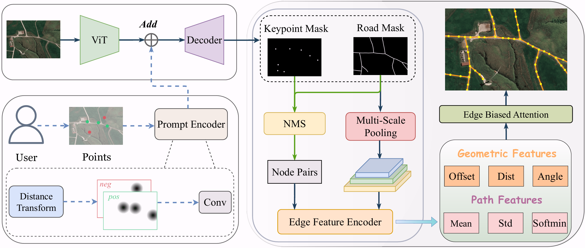
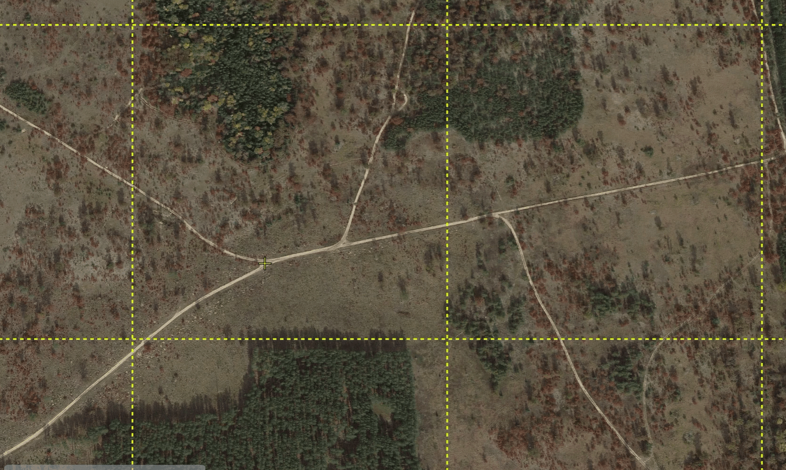

<h1 align="center">
  MaGRoad-Prompt
  <br>
  <small>The First Interactive Road Network Annotation Tool</small>
</h1>

<div align="center">

[](https://opensource.org/licenses/MIT)
[](https://pytorch.org/)
[](https://reactjs.org/)
[](https://fastapi.tiangolo.com/)

</div>

<div align="center">

[**[ArXiv Paper]**](https://arxiv.org/abs/2512.10416v2) | [**[Automated Extraction]**](https://github.com/xiaofei-guan/MaGRoad) | [**[WildRoad Dataset]**](#)

</div>

This repository contains the official implementation of the **Interactive Algorithm** and **Annotation Tool** from the paper: **Beyond Endpoints: Path-Centric Reasoning for Vectorized Off-Road Network Extraction**.

## 📖 Introduction

**MaGRoad-Prompt** is the **first interactive road network extraction algorithm and tool**, designed to bridge the gap between automated extraction and human expertise. It serves as an Interactive Road Network Annotation Tool based on MaGRoad, providing a user-friendly application for generating precise road masks and graph structures via interactive prompting.

<div align="center">
  
  <br/>
  <em>Figure 1: The architecture of the interactive algorithm based on MaGRoad. If you are interested in MaGRoad, please refer to the <a href="https://github.com/xiaofei-guan/MaGRoad">MaGRoad</a> code.</em>
</div>

## 💻 Interactive Annotation Tool

Our web-based application transforms the annotation workflow. Below is the main interface of the tool:

<div align="center">
  
</div>

### Efficient Workflow vs. Manual Annotation

Compared to traditional manual plotting (e.g., QGIS), MaGRoad-Prompt significantly reduces effort by intelligently inferring path connectivity from sparse user clicks.

| **Manual Annotation (QGIS)** | **Interactive Annotation (Ours)** |
|:----------------------------:|:---------------------------------:|
|  |  |

### Diverse Scenarios

**Satellite Imagery**: The model handles complex large-scale road networks effectively.

<table>
  <tr>
    <td align="center"><video src="https://github.com/user-attachments/assets/0b0165cb-5685-44f6-a321-ea9b2fe0ce2b" controls="controls"></video></td>
    <td align="center"><video src="https://github.com/user-attachments/assets/137a5141-8c66-46ac-b049-7b5dd5a45213" controls="controls"></video></td>
  </tr>
</table>

**UAV Generalization**: Although trained only on satellite imagery, the model demonstrates strong generalization capabilities on UAV images.

<table>
  <tr>
    <td align="center"><video src="https://github.com/user-attachments/assets/ea9a8d7c-1ebb-468c-bb2d-10b7dfe415c2" controls="controls"></video></td>
    <td align="center"><video src="https://github.com/user-attachments/assets/a46214cd-9919-4742-9be5-716741c6f651" controls="controls"></video></td>
    <td align="center"><video src="https://github.com/user-attachments/assets/53989c54-e761-449d-b924-fd9db32d4291" controls="controls"></video></td>
  </tr>
</table>

---

## 🚀 Usage

Follow these steps to set up and run the annotation tool.

### 1. Environment Setup

```bash
conda create -n magroad-prompt python=3.8
conda activate magroad-prompt
```

**Backend (Algorithm)**
```bash
cd app/backend
pip install -r requirements.txt
```

**Frontend (Interface)**
Ensure Node.js is installed.
```bash
cd app/frontend
npm install # npm==10.8.2
```

### 2. Model Preparation

Download the provided open-source checkpoint from [**here**](https://drive.google.com/file/d/1eOEcR7LRm8jBw6utUCPccjj4z-fHRou6/view?usp=sharing) and place it under `./app/backend/app/models/weights`:

```bash
mkdir -p app/backend/app/models/weights
# Save the downloaded checkpoint here
```


### 3. Start the Application

**Start Backend**
```bash
cd app/backend
uvicorn main:app --reload --port 8000
```

**Start Frontend**
```bash
cd app/frontend
npm run dev
```

Open your browser (typically `http://localhost:5173`) to start using the tool.

---

## 🧠 Interactive Algorithm (Training)

If you wish to train the interactive algorithm on your own data or the WildRoad dataset, follow the steps below.

### 1. Data Preparation
Generate masks for the WildRoad dataset:
```bash
python wildroad/generate_masks_for_wild_road.py --input_dir ./wildroad/wild_road --output_dir ./wildroad/wild_road_mask
```

### 2. Model Preparation

Download the **ViT-B** checkpoint from the [SAM repository](https://dl.fbaipublicfiles.com/segment_anything/sam_vit_b_01ec64.pth) and place it under `ckpt`:

```bash
mkdir -p ckpt
# Save sam_vit_b_01ec64.pth here
```

### 3. Training
Train the model to understand path connectivity from sparse prompts.
```bash
python train.py --config=config/toponet_vitb_1024_wild_road.yaml
```

### 4. Testing & Configuration Update
Evaluate the model to find the optimal thresholds.
```bash
python test.py --config=config/toponet_vitb_1024_wild_road.yaml --checkpoint=<your_ckpt_path>
```

**Integrating Custom Models into the Tool:**
After training, update the backend configuration to use your new model:
1.  Copy your checkpoint to `app/backend/app/models/weights/`.
2.  Edit `app/backend/app/models/road_extraction_algorithm/config_road_extraction.yaml`.
3.  Update `ROAD_EXTRACTION_MODEL_CKPT_PATH` with your checkpoint filename.
4.  Update `ITSC_THRESHOLD`, `ROAD_THRESHOLD`, and `TOPO_THRESHOLD` with the values obtained from the test step.

## 📍 Citation

If you use MaGRoad-Prompt or the WildRoad dataset in your research, please cite:

```bibtex
@article{magroad2025,
  title={Beyond Endpoints: Path-Centric Reasoning for Vectorized Off-Road Network Extraction},
  author={Guan, Wenfei and Mei, Jilin and Shen, Tong and Wu, Xumin and Wang, Shuo and Min, Cheng and Hu, Yu},
  journal={arXiv preprint arXiv:2512.10416},
  year={2025}
}
```
